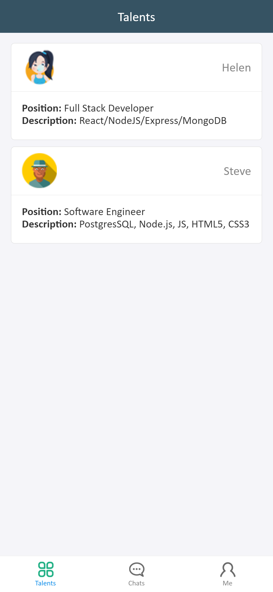
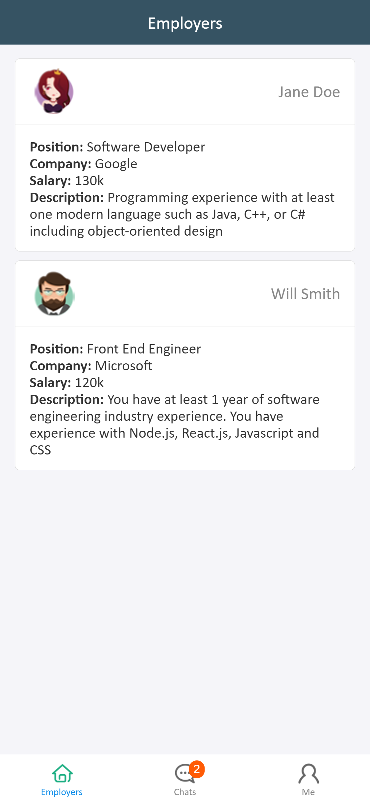
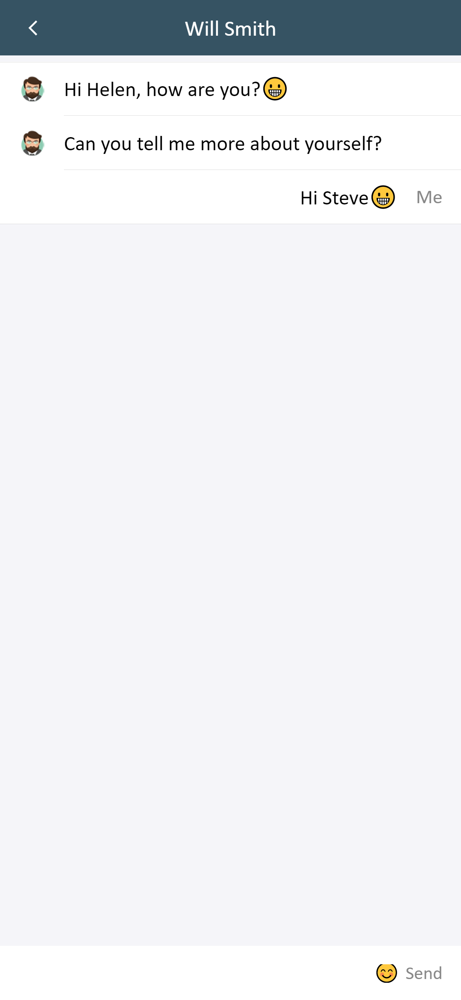
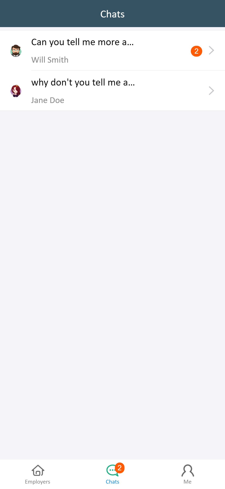

# HIRED -- Employer-Employee matchmaking App 
A simple real-time chat application implementation using Socket.io, Node, React Redux.

## Setup and run
* Run `npm i` in both /server and /client directories.
* Open two terminal windows and navigate to both of these directories and run `npm start`

## Instructions to run this app
For signing in differently in the app, you can use two different browser windows opening the same application and can chat in real-time.

## Preview
  &nbsp;&nbsp;&nbsp;  &nbsp;&nbsp;&nbsp;     

   &nbsp;&nbsp;&nbsp;    &nbsp;&nbsp;&nbsp;    
